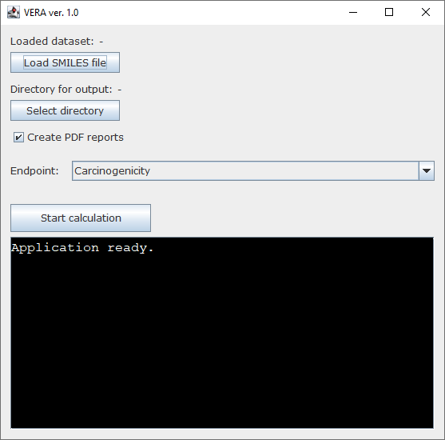
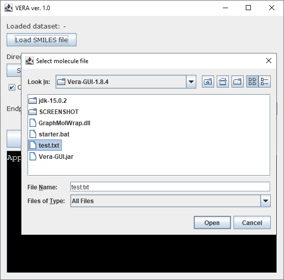
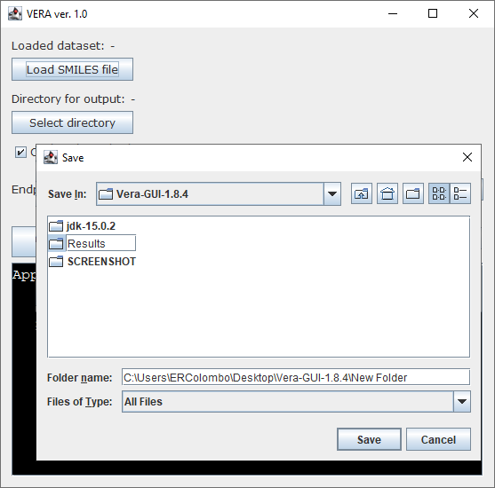
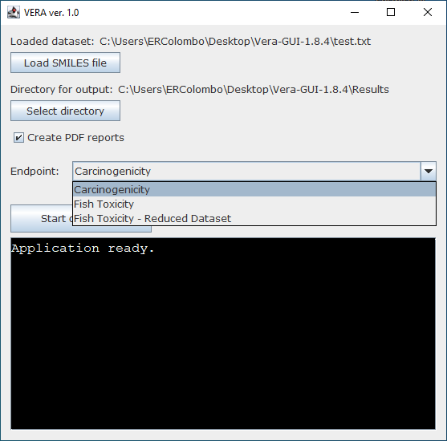
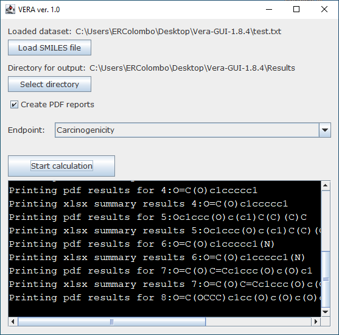
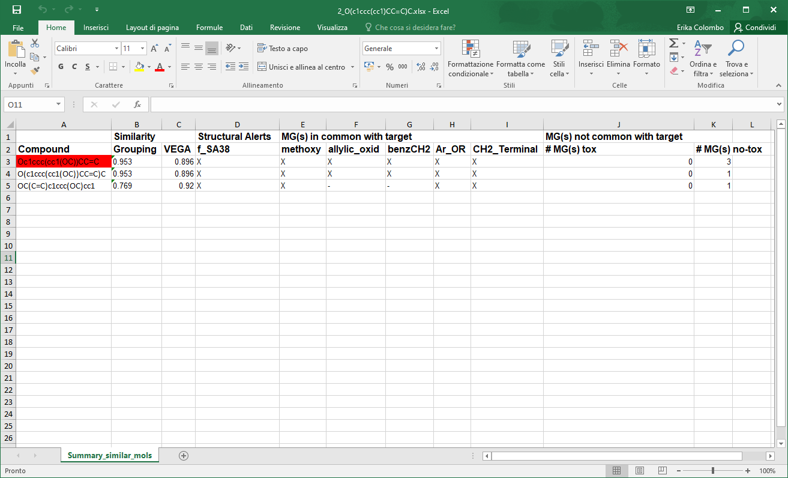
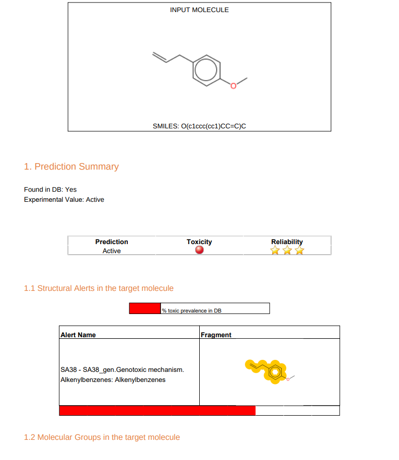
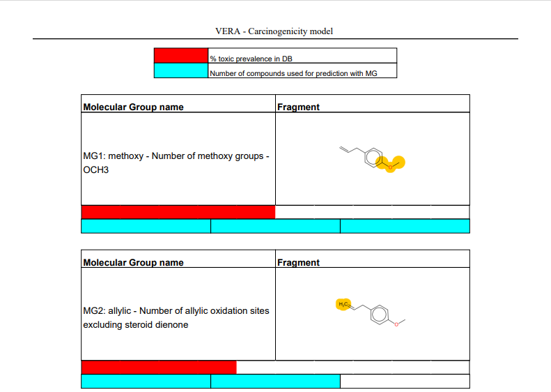
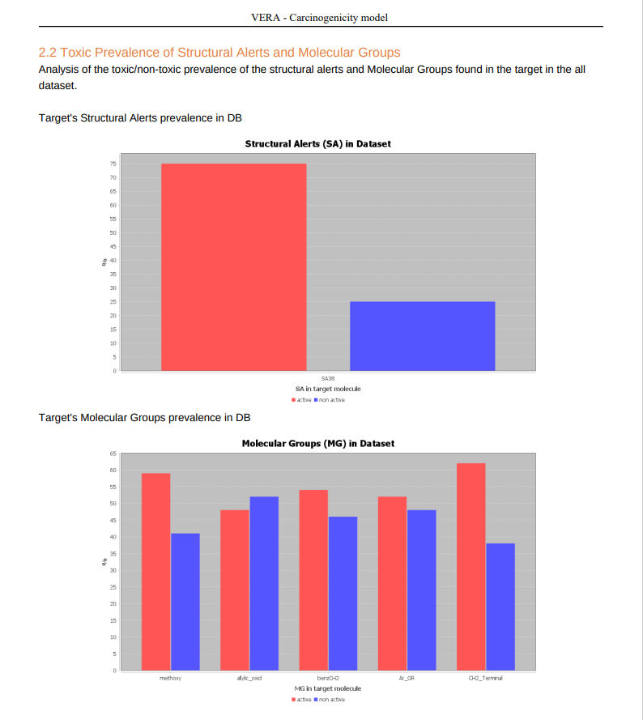
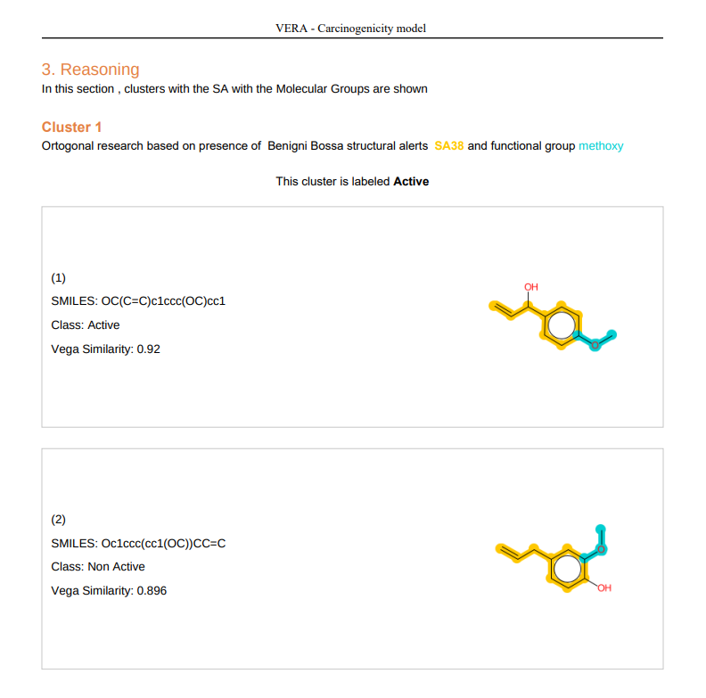

# Virtual-Extensive-Read-Across-VERA-

A new open-access software for chemical read-across, using structural alerts and chemical molecular groups

## What is for?

VERA is a new open-access software for chemical read-across, using structural alerts and chemical molecular groups.
Read-across applies the principle of similarity to identify the most similar substances to represent a given target substance in data poor situations. However, differences between the target and the source substances exist. 
VERA (Virtual Extensive Read-Across) provides a means to assess similarity between chemicals using structural alerts specific to the property, pre-defined molecular groups and structural similarity. The software finds the most similar compounds with a certain feature e.g. structural alerts and molecular groups and provides clusters of similar substances while comparing these similar substances within different clusters. 

### Case studies

Carcinogenicity is a complex endpoint with several mechanisms, requiring resource intensive experimental bioassays, a large number of animals and the use of read-across as part of New Approach Methodologies would support carcinogenicity assessment. To test the VERA software, carcinogenicity was selected as the endpoint of interest for a range of botanicals. VERA correctly labelled 70% of the botanicals, indicating the most similar substances and the main features associated with carcinogenicity.

Also the acute fish toxicity LC50 was selected as key endpoint to evaluated VERA for continuous endpoint.


##### REFERENCE

Further details on the algorithms used to performe read across assessment can be found in the reference pubblication:

Viganò, E.L.; Colombo, E.; Raitano, G.; Manganaro, A.; Sommovigo, A.; Dorne, J.L.C.; Benfenati, E. Virtual Extensive Read-Across: A New Open-Access Software for Chemical Read-Across and Its Application to the Carcinogenicity Assessment of Botanicals. Molecules 2022, 27, 6605. https://doi.org/10.3390/molecules27196605 

## GUI VERSION 

In [VEGAHUB](https://www.vegahub.eu/download/) a graphical user interface (GUI) version of VERA will be available soon.

### HOW TO USE

The VEGA GUI is a stand-alone application, it is not necessary to install the software. In VEGAHUB you can download the .zip folder of the program and open the tool by clicking on the .bat file.

<p align="center">
  
</p>

1. Load the .txt file with SMILES of target compounds (no header).

<p align="center">
  
</p>

2. Select the folder for the output files

<p align="center">
  
</p>

3. Choose the endpoint of interest

<p align="center">
  
</p>

4. Click on _Start Calculation_ 
<p align="center">
  
</p>

The folder chosen for results will contain one pdf file and an excel file for each substance and a .txt file with a summary of all predictions.

#### Output example
The excel file contain the information about all similar compounds used to make the assessment and molecular groups and structural alerts in common with the target molecule

<p align="center">
  
</p>

The pdf file contain the output of the VERA read-across algorithm.

At first, the summary of input molecule is shown, with the VERA assessment. The experimental value of target is reported if the molecule is already present in the database. The summary section includes also the information about the Structural Alerts and Molecular group identified in the target, with a colored bar representing the general toxic prevalence of this fragments in the database.

<p align="center">
  
</p>

<p align="center">
  
</p>

Then, the first six similar compounds are shown, with the VEGA similarity, the Group Similarity (calculated according to the MGs in common and not with the target), the similarity mean and a list of all MG found in the similar. Summary information are reported in the excel file as well.

<p align="center">
  
</p>

A focus on the toxic/non toxic prevalence of SAs and MGs is shown and than the result of cluster analysis.

<p align="center">
  
</p>

<p align="center">
  
</p>


## INSTALLATION of Python code
### HOW TO INSTALL 
1. _python_ and _Anaconda_ are both required
- Download and install _Anaconda_ from https://www.anaconda.com/distribution/. Choose Anaconda with Python 3
- Open the Anaconda Prompt (anaconda3).
- Create and activate a new RDKit Python environment (my-rdkit-env) with the following commands:
        
       conda create -c https://conda.anaconda.org/rdkit -n my-rdkit-env rdkit
       conda activate my-rdkit-env
        
2. Install _jupyter notebook_ in the same env: the procedure are described here https://jupyter.org/install
        
3. Install all _packages_ in your env: use the following command to install python libraries required for VERA. 
        
        pip install package_name
        #pip install pandas

You can find all packages required in the first chunk of VERA.ipynb file:
        
```python
# Data Analisys library
import pandas as pd
import numpy as np

# standard library
import subprocess
import os
from tqdm import tqdm
import shutil

# library useful for output
from fpdf import FPDF
from PyPDF2 import PdfFileMerger
import xlsxwriter
import matplotlib.pyplot as plt
from PyPDF2 import PdfFileMerger
import seaborn as sns
from matplotlib.colors import ColorConverter 
        
```
4. Download this repository 

## HOW TO USE THE VERA TOOL
1. Open with notebook Vera.ipynb
2. Choose the file names with target molecules.
  note: must be a .xlsx files with column name: SMILES
3. Run the code
4. You can find a folder named **result** that contain pdf output and excel file

## CONTACT

Edoardo Luca Viganò

Laboratory of Environmental Chemistry and Toxicology

Department of Environmental Health Sciences

Istituto di Ricerche Farmacologiche Mario Negri IRCCS

Via Mario Negri 2, 20156 Milano, Italy

e-mail: edoardo.vigano@marionegri.it
